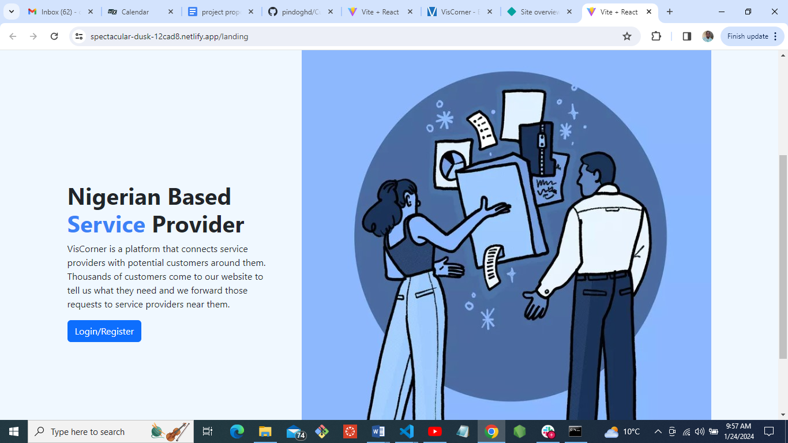

  # Viscorner Dash Board

  ## Description
  Welcome to the Viscorner Dashboard project! This application serves as a tracking system for customer requests on the Viscorner company website. Users can view request details such as ID, title, time, and description, providing valuable insights into user activities on the platform.

  ## Installation
 
  The application is designed to seamlessly integrate with the Viscorner official website.https://viscorner.com/

  ## Usage
  Sign up or log in to the Viscorner website.
  Once logged in, the landing page will display a sidebar containing various buttons, including the "Request" button.
  Click on the "Request" button to generate a card, opening a popup with an overlay.
  The popup will display information such as ID, title, time, description, and any relevant images.

  Deployed link - https://spectacular-dusk-12cad8.netlify.app
  

  ## Technologies used
  The Viscorner Dashboard is crafted using modern technologies, including:
  React
  npm packages
  JavaScript
  Bootstrap
  Viscorner API (for data retrieval)

  ## Contributors
  Chak Cheong Chan,
  Thomas Francis,
  Akorede Odunsi &
  Samirah Mahroof

  ## Testing
  Feel free to test the application by signing up or logging into the Viscorner website.

  ## License
  N/A
  
  
  
